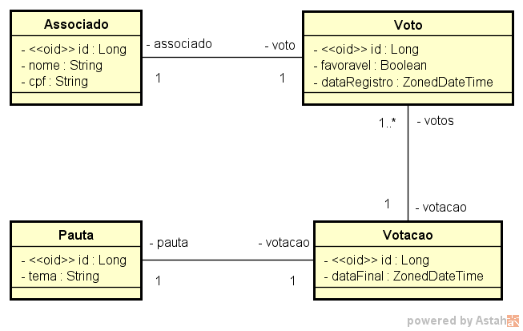
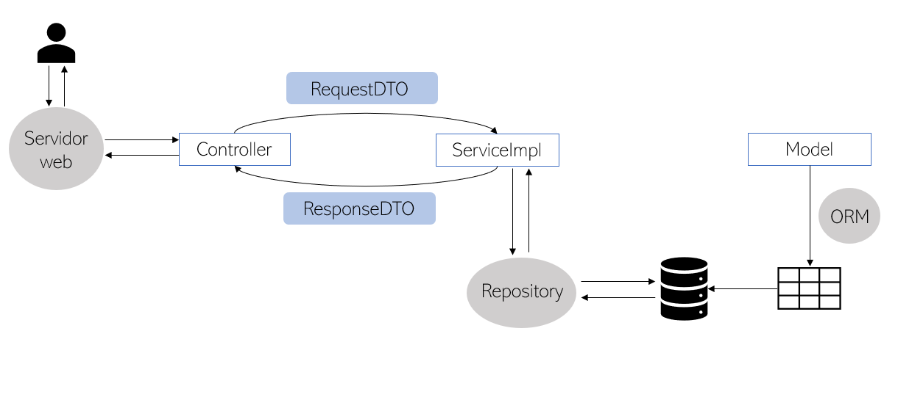

# Votos API
 
Este projeto é uma API desenvolvida em linguagem Java. Foi realizado como desafio técnico para o programa de aceleração do Meta League - T4. A API tem como objetivo gerenciar sessões de votação, permitindo cadastrar associados e pautas, além de registrar votos e contabilizar o resultado das votações.
 
## Tabela de conteúdos
 
   * [Sobre](#votos-api)
   * [Modelo conceitual](#modelo-conceitual)
   * [Tecnologias utilizadas](#tecnologias-utilizadas)
   * [Ferramentas utilizadas](#ferramentas-utilizadas)
   * [Dependências utilizadas](#dependências-utilizadas)
   * [Como executar o projeto](#como-executar-o-projeto)
     * [Pré-requisitos](#pré-requisitos)
     * [Execução](#execução)
   * [Endpoints](#endpoints)
   * [Equipe](#equipe)
 
## Modelo conceitual
 
<div align="center">

</div>

<div align="center">

</div>
 
## Tecnologias utilizadas
 
As seguintes tecnologias foram utilizadas na construção do projeto:
 
   * Java
   * JPA
   * Maven
   * Spring Boot
 
## Ferramentas utilizadas
 
As seguintes ferramentas foram utilizadas na construção do projeto:
 
   * [JDK](https://www.oracle.com/java/technologies/downloads/) | Versão 17+
   * [Insomnia](https://insomnia.rest/download)
   * [IntelliJ IDEA](https://www.jetbrains.com/pt-br/idea/download/#section=windows)
 
## Dependências utilizadas
 
| Nome  |   Descrição    |
| ------------ | :------------: |
| [spring-boot-starter-web](https://mvnrepository.com/artifact/org.springframework.boot/spring-boot-starter-web) | Usa Spring MVC para construção de aplicações web e API RESTful |
| [spring-boot-starter-data-jpa](https://mvnrepository.com/artifact/org.springframework.boot/spring-boot-starter-data-jpa) | Implementação da JPA para persistência de dados usando Spring Data e Hibernate |
| [spring-boot-starter-validation](https://mvnrepository.com/artifact/org.springframework.boot/spring-boot-starter-validation) | Validação de Beans com Hibernate Validator  |
| [flyway-core](https://mvnrepository.com/artifact/org.flywaydb/flyway-core) | Ferramenta para controle de versão dos scripts SQL do banco de dados |
| [flyway-mysql](https://mvnrepository.com/artifact/org.flywaydb/flyway-mysql) | Plugin para executar scripts MySQL no Flyway  |
| [lombok](https://mvnrepository.com/artifact/org.projectlombok/lombok) | Biblioteca de anotações Java para reduzir código boilerplate |
| [mysql-connector-j](https://mvnrepository.com/artifact/com.mysql/mysql-connector-j) | Driver JDBC para MySQL |
| [spring-boot-devtools](https://mvnrepository.com/artifact/org.springframework.boot/spring-boot-devtools) | Conjunto de funcionalidades para auxílio no desenvolvimento da aplicação |
| [spring-boot-starter-test](https://mvnrepository.com/artifact/org.springframework.boot/spring-boot-starter-test) |  Starter que disponibiliza as dependências necessárias para a realização de testes da aplicação |
 
## Como executar o projeto
 
### Pré-requisitos
 
Para que seja possível executar o projeto, é necessário que em sua máquina estejam instalados:
 
   * [Git](https://git-scm.com/)
   * JDK
   * Insomnia
   * IntelliJ IDEA
 
### Execução
 
1. Abra um terminal do Git na pasta desejada e clone este repositório:
```bash
$ git clone https://gitlab.meta.com.br/t4-projeto-api/votos-api.git
```
2. Em seguida, abra o projeto no IntelliJ IDEA e o execute.
3. O servidor iniciará na porta 8080. Após iniciado, realize as ações de CRUD pelo Insomnia.
 
## Endpoints
 
Os _endpoints_ deste projeto estão documentados abaixo:

### Associado

| Método HTTP          |  Resource Path | Descrição                        |
| -------------------- | -------------- | :------------------------------: |
| GET                  |  /associados        | Lista associados |
| GET                  |  /associados/{id}        | Busca associado por ID |
| POST                 |  /associados        | Cadastra um associado |
| PUT                  |  /associados        | Atualiza um associado |
| DELETE               |  /associados/{id}        | Deleta um associado |

### Pauta

| Método HTTP          |  Resource Path | Descrição                        |
| -------------------- | -------------- | :------------------------------: |
| GET                  |  /pautas        | Lista pautas |
| GET                  |  /pautas/{id}        | Busca pauta por ID |
| POST                 |  /pautas        | Cadastra uma pauta |
| PUT                  |  /pautas        | Atualiza uma pauta |
| DELETE               |  /pautas/{id}        | Deleta uma pauta |

### Votação

| Método HTTP          |  Resource Path | Descrição                        |
| -------------------- | -------------- | :------------------------------: |
| GET                  |  /votacoes        | Lista votações |
| GET                  |  /votacoes/{id}        | Busca votação por ID |
| GET                  |  /votacoes/{id}/resultado  | Busca resultado da votação |
| POST                 |  /votacoes        | Cadastra uma votação |
| PUT                  |  /votacoes        | Atualiza uma votação |
| DELETE               |  /votacoes/{id}        | Deleta uma votação |

### Voto

| Método HTTP          |  Resource Path | Descrição                        |
| -------------------- | -------------- | :------------------------------: |
| GET                  |  /votacoes/{id}/votos        | Lista votos |
| GET                  |  /votacoes/{id}/votos/{id}        | Busca voto por ID |
| POST                 |  /votacoes/{id}/votos        | Cadastra um voto |
 
## Equipe
 
Ana Carolina Bilecki

Nathália Amorim Lima De Moraes

Paulo Thiago De Assis Antunes
